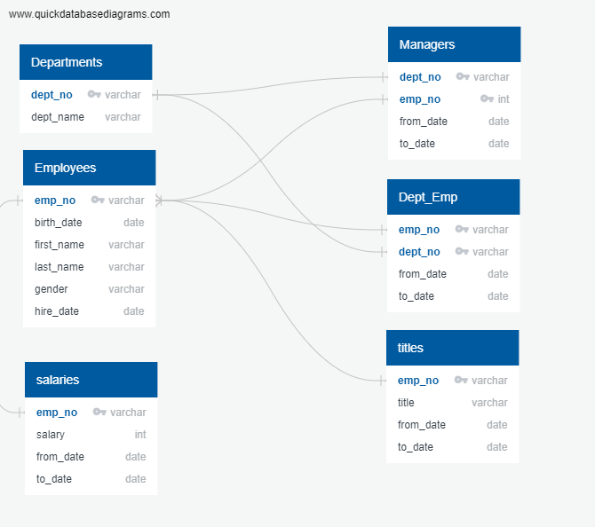

# Pewlett-Hackard-Analysis

Main SQL file located in Queries

## Overview
My client requested me to create an employee database using SQL to upgrade their current system of using CSV files in Excel and VBA. The purpose of this schema attached is to create useable database. In addition, looking at the database, we can now begin to query the data to determine the employees who fit specific conditions. In this case, we are looking to see how many people will be retiring soon.

## Results
### Fig 1. Entity Relationships

As shown in the entity relationship diagram, we begin to get an idea of how the data is connected. There are many different spreadsheets of data that all has a different piece of information to say. We can put these together to get an overall understanding of the company and its employees.

Here are the findings of the query:
* Looking through the retirement_info table, we can see that there are over 72,000 employess that are retiring soon. This information was found by narrowing down the birthdays of the employees from 1952 to 1955. This value represents roughly 30% of the employees (72,000 out of 240,000) This large number of retiring employees implies that the Pewlett Hackard will be struggling to keep up in the coming years.
* Looking through the retiring_titles table, we can see the summary of the counts of employees retiring with a specific title. This has been cleaned up to include only titles they currently hold and we see that there a nearly 26,000 Senior Engineers and nearly 25,000 Senior Staffs who are going to be retiring soon.
* The mentorship that is being set in place will be a great start to keeping up with the changes that will soon come to the company. We see that there is 1549 employees who are eligible to become mentors. 
* The ratio of the eligible mentors for Senior Engineers is 400:86000. The ratio of eligible mentors for Senior Staff is 284:82000. Even if only the new hires need mentorship, it will still be a daunting task for the mentors as that would be 51,000 employees to train. That number does not even include the other titles that will need to be trained. Mentors will need to be fairly compensated and given very clear instructions on how to approach to make their time as mentors effective.

## Summary
1. As the wave of retirement approaches, they will need to hire more than 70,000 employees in order to combat the dwindling workforce. The two titles that will need to hired the most is Senior Engineer and Senior Staff. Both fit in a multitude of departments, and are essential in the teams of employees. They account for 70% of the retiring employees. It will take a lot of effort to hire new staff to take their place. Ideally, if we are going to combat this, we would need to hire roughly 17,500 (70000/4) new employees a year to fill the gap (and this is with the assuption that they retire based only on a specific age). 
2. There are 1549 emplyoees who are eligible for mentoring. Furthermore, looking through the table further reveals that there are 411 Senior Engineers and 284 Senior Staff who are eligible. With the potential 26,000 Senior Engineers and 25,000 Senior Staff needing to be mentored over the span of the next few years, we could be looking at a very difficult, maybe near impossible, task for these mentors. I suggest furthering the pool of retirement elgibility to include those born from 1965 to 1970. In addition, I recommend adding an additiona criteria in the query to make sure their hire date is over a certain minimum number of years ago. That way, our mentors are well adapted to the environment and will have expert knowledge of our company.
